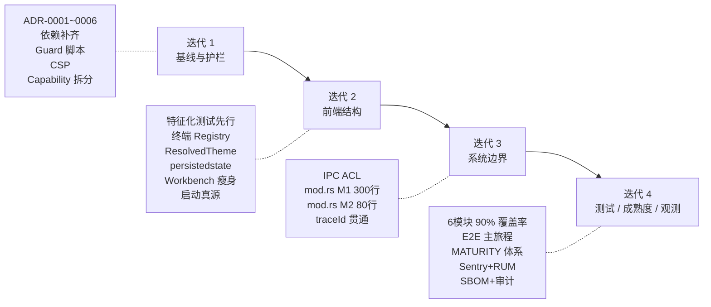

## 0. 使用说明

<aside>
🤖

**读者**：执行重构的 AI 编码代理（code agent）。

**前置**：本方案与仓库内 [AGENTS.md](http://AGENTS.md)（SSoT）并行生效；冲突时以 [AGENTS.md](http://AGENTS.md) 为准，本方案仅定义「如何一步步达到 [AGENTS.md](http://AGENTS.md) 要求的稳态」。

**任务 ID**：`T-<迭代>.<序号>`。每个任务含：目的、前置依赖、执行步骤、验收标准、失败回滚策略。

**执行纪律**：

1. MUST 按迭代顺序执行；同一迭代内允许并行，跨迭代 MUST NOT 穿插。
2. 遇到与 [AGENTS.md](http://AGENTS.md) 冲突 MUST 停下登记 ADR，MUST NOT 猜测。
3. 任一任务未通过验收 MUST NOT 进入下一任务；MUST 先回滚再汇报。
4. 本方案每条任务要求的 ADR、脚本、基线文件 MUST 真实创建，不可空引用。
</aside>

```yaml
plan_version: 1.0.0
based_on_ssot: AGENTS.md
audience: ai-code-agent
language: zh-CN
iteration_count: 4
total_task_count: 38
acceptance_mode: rule-based  # 面向规则，不面向感觉
```

---

## 1. 总体目标与约束

### 1.1 稳态目标（整改完成的硬指标）

- **SG-1** `src/composables/useWorkbench.ts` ≤ 400 行（不含 TSDoc）。
- **SG-2** `src/views/ShellWorkbenchView.vue` 的 `<script setup>` ≤ 120 行；模板内业务分支 ≤ 3 处；MUST NOT 直接 import 任何业务 store。
- **SG-3** `src/composables/useIntegratedTerminal.ts` 不存在模块级可变共享状态；终端会话 MUST 经 registry 暴露。
- **SG-4** `src/store/app.ts` MUST NOT 直接调用 `document.*` / `localStorage.*`；持久化经 `pinia-plugin-persistedstate`。
- **SG-5** `src-tauri/src/commands/mod.rs` ≤ 80 行，仅 `pub use` + `tauri::generate_handler!`；其余逻辑按 8 个领域拆分。
- **SG-6** `src-tauri/tauri.conf.json.app.security.csp` 非 null，显式白名单。
- **SG-7** `src-tauri/capabilities/` 按 5 个命令域拆分（窗口 / 文件 / 脚本工具链 / 终端 / Git）。
- **SG-8** 所有 IPC 命令在 `services/tauri.ts` 侧具备：入参 schema、出参 schema、`AppError` 归一化、traceId、超时、取消、结构化日志。
- **SG-9** 6 个关键模块差分覆盖率 ≥ 90%：主题合成、workbench façade、终端状态机、结构化运行报告、Shell 补全、Git diff。
- **SG-10** 仓库具备 [MATURITY.md](http://MATURITY.md) 体系；UI 成熟度标识来自生成物而非硬编码。
- **SG-11** 启动链路单一真源（App.vue 协调，Rust `apply_window_stage` 驱动）；`main.ts` ≤ 120 行。
- **SG-12** CI 四件套 + 静态守卫 + 关键模块测试 + 桌面 E2E 冒烟全部阻断式。

### 1.2 执行原则

1. **先装护栏，不先拆业务**。iteration 1 的唯一目的是阻止继续劣化。
2. **高风险重构前必须先写特征化测试**（characterization test）。禁止「拆完再补测」。
3. **存量违规走豁免清单**，新增违规即 fail。避免 iteration 1 CI 全红。
4. **ADR 先行**。凡偏离 [AGENTS.md](http://AGENTS.md) 的决策，MUST 先 ADR，再动代码。
5. **不并行拆架构 + 补测试 + 改安全**。按本方案 4 个迭代顺序推进。

### 1.3 冲突优先级

`安全 > 类型安全 > 可测性 > 可维护性 > 性能 > 代码风格`，与 [AGENTS.md](http://AGENTS.md) 一致。

---

## 2. 迭代 1：基线与护栏（止血期）

<aside>
🩹

**目标**：让「继续变坏」的通道关闭，不要求任何业务结构变好。

**时长参考**：1～2 周。

**退出条件**：SG-6 / SG-7 达成；存量违规全部进入豁免清单；关键 ADR 合入；CI 新增守卫生效。

</aside>

### T-1.1　建立 ADR 基础设施

- **目的**：后续所有偏离 SSoT 的决策有归处。
- **执行**：
    1. 创建 `docs/architecture/` 目录。
    2. 创建 ADR 模板 `docs/architecture/_TEMPLATE.md`，含：背景 / 决策 / 备选 / 影响 / 相关链接 / 状态（`proposed` / `accepted` / `superseded`）。
    3. 创建 ADR 索引 `docs/architecture/README.md`。
- **验收**：
    - 目录与模板存在，模板字段齐全。
    - `docs/architecture/README.md` 含 ADR 列表表格（初始为空）。

### T-1.2　ADR-0001 启动真源选 B（App.vue 协调）

- **目的**：终结 main.ts 与 App.vue 双实现。
- **执行**：落 ADR，内容至少覆盖：
    - 四阶段生命周期：透明欢迎窗 → bootstrap splash → 主窗口 → 工作台挂载。
    - 驱动方：Rust `apply_window_stage`；订阅方：`App.vue`；`main.ts` 职责收敛为最早期错误处理 + 主题同步注入 + Vue 挂载失败兜底。
    - SplashScreen DOM 归 Vue 侧，`main.ts` 内联 DOM ≤ 120 行。
    - 迁移计划：先 ADR，再在 iteration 2 的 T-2.7 落地。
- **验收**：
    - ADR 状态 `accepted`，Code Owner 签字。
    - ADR 列表更新。

### T-1.3　ADR-0002 依赖基线一次性补齐

- **目的**：消除「规则有、底座没」。
- **执行**：ADR 明确以下依赖的精确版本并更新 [AGENTS.md](http://AGENTS.md) 第 0 章基线表（MUST 与 [AGENTS.md](http://AGENTS.md) 保持一致）：
    - 运行时校验：`zod`
    - 持久化：`pinia-plugin-persistedstate`
    - 终端：`xterm`、`xterm-addon-fit`、`xterm-addon-web-links`
    - 解析：`tree-sitter`、`tree-sitter-bash`
    - Tauri：`@tauri-apps/api`、`@tauri-apps/plugin-dialog`、`@tauri-apps/plugin-fs`、`@tauri-apps/plugin-shell`（若启用）
    - 测试：`vitest`、`@vue/test-utils`、`@playwright/test`
    - 静态守卫：`size-limit`、`@size-limit/preset-app`、`dpdm`、`stylelint`、`stylelint-config-tailwindcss`
    - 安全：`gitleaks`（二进制走 CI）、`cargo-audit`（cargo 扩展）、`cargo-deny`
    - a11y：`@axe-core/playwright`
- **验收**：
    - `package.json` / `Cargo.toml` 更新；`pnpm-lock.yaml` / `Cargo.lock` 重新生成。
    - `scripts/check-versions.ts` 通过（跨文件版本一致性）。
    - `pnpm install --frozen-lockfile` 成功。

### T-1.4　ADR-0003 静态守卫与存量豁免机制

- **目的**：让守卫能落地但不立刻炸 CI。
- **执行**：
    1. 建立 `scripts/baselines/` 目录，每个守卫对应一份 JSON：`file-size.json`、`workbench-facade.json`、`dead-imports.json`、`dormant-modules.json`、`theme-keys.json`、`capability-domains.json`、`rust-mod-size.json`。
    2. 每条豁免记录结构固定：`{ path, rule, reason, owner, adrRef, expiresAt }`；`expiresAt` MUST ≤ iteration 4 末尾 + 4 周。
    3. 守卫脚本行为：新增违规直接 fail；命中豁免清单则 warn；豁免到期自动转 fail。
    4. 初始化豁免条目（基于当前已知违规）：
        - `src/composables/useWorkbench.ts` → `file-size` 豁免至 iteration 2 结束。
        - `src/views/ShellWorkbenchView.vue` → `file-size` + `no-business-store-import` 豁免至 iteration 2 结束。
        - `src/composables/useIntegratedTerminal.ts` → `no-module-shared-state` 豁免至 iteration 2 结束。
        - `src/store/app.ts` → `no-direct-dom-write` + `no-direct-localstorage` 豁免至 iteration 2 结束。
        - `src-tauri/src/commands/mod.rs` → `rust-mod-size` 豁免至 iteration 3 结束。
        - `components.json` 悬空 Tailwind 引用 → 豁免至 T-1.8 修复当周。
- **验收**：
    - 豁免清单 JSON 存在且格式校验通过。
    - `pnpm run guard` 在当前仓库状态下返回 0（全部命中豁免）。

### T-1.5　编写静态守卫脚本

- **目的**：把 [AGENTS.md](http://AGENTS.md) 第 20 章的 Enforcement 真正落成 CI 检查。
- **执行**：在 `scripts/` 下新增（TypeScript，用 `tsx` 执行）：
    - `check-file-size.ts`：对 `useWorkbench.ts` / `ShellWorkbenchView.vue` / Rust 模块分别执行阈值。
    - `check-workbench-facade.ts`：扫描 `views/**` 与 `layouts/**` 内对业务 store 的直接 import，≥ 2 个即 fail（R-18.11.1）。
    - `check-router-disabled.ts`：若 `main.ts` 出现 `app.use(router)` 且无 ADR → fail（R-18.2.3）。
    - `check-terminal-singleton.ts`：扫描 `new Terminal(` 出现位置，白名单仅 `composables/useIntegratedTerminal.ts`（T-2.3 之后改为白名单仅 terminal registry 模块）。
    - `check-capabilities-domain.ts`：校验 `src-tauri/capabilities/` 存在 5 个域文件（T-1.8 达成前命中豁免）。
    - `check-theme-keys.ts`：主题 CSS 变量 ↔ `src/types/shadcn-theme.ts` 键名一致性。
    - `check-env-vars.ts`：`VITE_*` 登记一致性。
    - `check-config-refs.ts`：扫描 `components.json` / `tauri.conf.json` 内引用路径是否存在。
    - `check-dead-imports.ts`：`dpdm` + 自定义规则。
    - `check-dormant-modules.ts`：扫 `router/**` 等 dormant 目录是否有 README 标注。
    - `check-versions.ts`：`package.json` / `src-tauri/tauri.conf.json` / `Cargo.toml` 版本一致性。
    - `check-maturity.ts`：每个一级目录下存在 `MATURITY.md`（T-4.5 落地后再开全量，初期只要求 `src/` 与 `src-tauri/src/` 顶层）。
- **验收**：
    - 所有脚本可独立运行，返回码正确。
    - `package.json` 新增 `scripts.guard` 聚合命令。
    - CI 新增 `guard` 阶段，位于 `lint` 与 `typecheck` 之间。

### T-1.6　CI 四件套与新增阶段落地

- **目的**：G-5 门禁真正生效。
- **执行**：
    1. 在 `.github/workflows/` 或 `.gitlab/ci/` 建立顺序流水线：`install` → `lint` → `guard` → `typecheck`（`vue-tsc --noEmit` + `cargo check`） → `test`（Vitest，允许初期空用例集但必须存在配置） → `build`（`vite build` + `cargo build --release`） → `size-limit` → `e2e`（iteration 4 前可仅跑冒烟）。
    2. 新增 pre-commit（`husky` + `lint-staged`）：ESLint + Prettier + `vue-tsc` 影响范围。
    3. commit-msg：`commitlint` + Conventional Commits。
    4. pre-push：typecheck + 影响范围单测。
    5. `gitleaks` pre-commit + CI 双兜底。
- **验收**：
    - 一条故意违规 PR（如裸 `any`、直推 main、缺 scope 的 commit）MUST 被阻断。
    - `--no-verify` 绕过行为在 CI 端被 `gitleaks` / `commitlint` 兜住。

### T-1.7　CSP 从 null 改为显式策略

- **目的**：达成 SG-6；修复 R-7.5.1 硬违规。
- **执行**：
    1. 起 ADR-0004：记录 dev / prod 两套 CSP 策略。
    2. `tauri.conf.json.app.security.csp` 设为显式字符串，**禁** `unsafe-inline` / `unsafe-eval`。`style-src` 初期放 `'self' 'nonce-<BUILD_NONCE>'`；`script-src` 放 `'self' 'nonce-<BUILD_NONCE>'`；`connect-src` 仅 `'self' ipc: http://ipc.localhost`；`img-src` 放 `'self' data: blob: asset: http://asset.localhost`；`font-src` 放 `'self' data:`；`worker-src` 放 `'self' blob:`（Monaco worker 需要）。
    3. `index.html` 同步主题注入脚本加 `nonce` 属性，nonce 由 Vite 插件注入。
    4. 新增 Playwright 冒烟 `e2e/smoke-csp.spec.ts`：启动应用 → 打开示例脚本 → Monaco 渲染正常 → xterm 渲染正常 → 控制台无 CSP violation。
- **验收**：
    - `tauri.conf.json.app.security.csp` 非 null。
    - 桌面冒烟测试绿。
    - DevTools Console 无 CSP 报错。

### T-1.8　Tauri capability 按 5 域拆分

- **目的**：达成 SG-7。
- **执行**：
    1. 基于现有 `src-tauri/capabilities/default.json` 审计所有权限。
    2. 拆分为 5 份：`capabilities/window.json`、`capabilities/workspace-fs.json`、`capabilities/script-toolchain.json`、`capabilities/terminal.json`、`capabilities/git.json`。
    3. 每份 capability 仅授予该域必需权限，MUST NOT 通配符。
    4. 如当前为单窗口，domain 拆分即视为组织性收益；ADR-0005 记录此意图，避免团队误解。
    5. 修复 `components.json:7` 悬空 Tailwind 配置引用。
    6. 给 `src/router/index.ts` 加顶部 README 注释：`// DORMANT: 当前未注册，禁止业务 import。详见 ADR-0006。`；或依据 ADR-0006 决定删除。
- **验收**：
    - `check-capabilities-domain.ts` 通过。
    - `check-config-refs.ts` 通过。
    - `check-dormant-modules.ts` 通过。

### T-1.9　文档基线

- **目的**：让第 14 / 16 / 17 章的文档枢纽有处可落。
- **执行**：创建空骨架（含「TODO: 迭代 N 填充」）：
    - `docs/tech-debt.md`
    - `docs/security-exceptions.md`
    - `docs/performance-budget.md`
    - `docs/observability.md`（字段表初版）
    - `docs/env-vars.md`
    - `docs/audit-events.md`
    - `docs/incident-runbook.md`
    - `docs/incident-log.md`
    - 根 `README.md` 补齐：技术栈与版本基线摘要 / 开发脚本 / 目录结构 / 贡献指南链接 / 许可证。
- **验收**：所有文件存在，链接互通，CI 有脚本校验 docs 链接可达。

### T-1.10　迭代 1 退出评审

- **目的**：进入 iteration 2 前冻结护栏。
- **执行**：
    1. 召集 Code Owner 审阅 ADR-0001 ～ ADR-0006。
    2. 跑一次完整 CI，确认 guard 阶段命中豁免而非 fail。
    3. 所有豁免条目 `expiresAt` 对齐 iteration 2 / 3 的结束时间。
- **验收**：
    - Code Owner 在评审记录上签字。
    - 主干分支绿。

---

## 3. 迭代 2：前端结构重构（瘦身期）

<aside>
✂️

**目标**：让 workbench、终端、主题三个核心前端结构进入稳态。

**时长参考**：2～3 周。

**硬前置**：T-2.1、T-2.2 的特征化测试必须在任何拆分之前写完并绿。

**退出条件**：SG-1、SG-2、SG-3、SG-4、SG-11 达成。

</aside>

### T-2.1　特征化测试：主题合成（最优先）

- **目的**：ResolvedTheme 拆分前先锁定当前行为。
- **执行**：
    1. 在 `src/themes/__tests__/resolved-theme.spec.ts` 建立纯函数测试：以当前 `themes/manager.ts` + `app.ts` 合成逻辑为黄金值，穷举 `(base: 'light'|'dark'|'system', override: {...})` 组合，断言输出 CSS 变量表。
    2. 用例 MUST 覆盖：强调色、圆角、密度、字号、字体族、terminal 派生、Monaco 派生。
    3. 建议 ≥ 24 个断言用例。
- **验收**：
    - 测试全绿（作为当前行为基线）。
    - 覆盖率 ≥ 90%（resolved-theme 模块本身）。

### T-2.2　特征化测试：终端状态机 + workbench façade

- **目的**：拆分前锁定外部可观察行为。
- **执行**：
    1. **终端状态转移表**：在 `src/composables/__tests__/integrated-terminal.state.spec.ts` 建表：`idle → starting → ready → dispatching → closing → closed`，每条转移断言：触发 event、副作用（PTY 创建 / 释放）、错误路径、cleanup 顺序。用 fake PTY（内存实现）替代真实 Tauri 事件。
    2. **workbench façade 快照**：在 `src/composables/__tests__/workbench.facade.spec.ts` 录制当前 façade 对外 API 的行为：`openFile(path)` / `closeFile(url)` / `runScript()` / `closeWindowSafely()` / `persistEditorState()` 等；用依赖注入 fake 替代 editor store / git store / terminal registry / notify。
- **验收**：
    - 两组测试全绿，作为 T-2.3 / T-2.5 的安全网。
    - 测试 MUST NOT 依赖真实 Tauri / 真实 Monaco / 真实 xterm。

### T-2.3　终端域：session / registry / UI adapter 三层拆分

- **目的**：达成 SG-3；保留单终端 UX，解绑唯一终端假设。
- **执行**：
    1. 新建 `src/terminal/session.ts`：`TerminalSession` 类，职责 = attach / detach / write / resize / dispose；构造注入 PTY 服务 + 主题派生 getter。
    2. 新建 `src/terminal/registry.ts`：`useTerminalRegistry()`，职责 = create / get / list / dispose；模块级状态仅允许 `Map<sessionId, TerminalSession>`，但 registry 本身通过 Pinia store 或 Vue `provide/inject` 暴露，MUST NOT 裸模块变量。
    3. 改造 `src/composables/useIntegratedTerminal.ts` 为 UI 适配层：只把面板事件与 registry 连接，不持有会话状态；行数 ≤ 200。
    4. 模块级 `sharedStatus` / `sharedTerminalRef` / `sharedVisibleRef` 全部迁移至 session 实例字段。
    5. 重跑 T-2.2 的状态转移表，零差异才合入。
- **验收**：
    - `check-terminal-singleton.ts` 白名单收窄到 `src/terminal/session.ts`。
    - 豁免清单中对应条目删除。
    - T-2.2 测试保持全绿。

### T-2.4　主题单派生原点：ResolvedTheme

- **目的**：达成 SG-4 主题侧；消除 `app.ts` 直写 document / localStorage。
- **执行**：
    1. 在 `src/themes/resolved-theme.ts` 定义 `ResolvedTheme` 类型与纯函数 `resolve(base, overrides): ResolvedTheme`。
    2. 派生出 CSS 变量表、Monaco 主题、xterm 终端主题（替代 `useIntegratedTerminal.ts:49` 的 `createTerminalTheme`）。
    3. 新建 `src/themes/effects.ts`：订阅 `ResolvedTheme` 变化 → 写 `document.documentElement.style`；这是 DOM 副作用的唯一出口。
    4. 改造 `useTheme.ts`：仅负责订阅 store + 系统主题监听 + 驱动 `effects.ts`。
    5. 改造 `store/app.ts:280-305`：删除所有 `documentElement` 写操作，只保留状态变更。
    6. 重跑 T-2.1 测试，零差异才合入。
- **验收**：
    - `app.ts` 搜索 `document.` / `localStorage` 零命中。
    - T-2.1 测试绿。
    - Monaco / xterm 主题切换视觉回归通过（新增 Playwright 截图比对）。

### T-2.5　`store/app.ts` 接入 `pinia-plugin-persistedstate`

- **目的**：达成 SG-4 持久化侧。
- **执行**：
    1. 在 `src/store/index.ts` 注册 `pinia-plugin-persistedstate`。
    2. 为 `useAppStore` 显式 `persist.paths`，只持久化：主题模式、强调色、圆角、密度、字号、字体族；**禁** 全量持久化。
    3. 编写数据迁移 `migrate(oldState, version)`：读取 `app.ts:229-271` 当前 localStorage key，写入新 path，清除旧 key。migration version 从 1 起。
    4. 统一 key 前缀（如 `shell-ide.`）。
- **验收**：
    - `app.ts` 无裸 `localStorage.*` 调用。
    - 手动升级测试：模拟升级前数据 → 启动应用 → 设置保留 → 旧 key 已清除。

### T-2.6　workbench 编排拆分 + façade 瘦身

- **目的**：达成 SG-1、SG-2。
- **执行**：
    1. 按 [AGENTS.md](http://AGENTS.md) R-20.1.1 列出的 7 项职责，拆出 7 个独立 composable（文件路径建议）：
        - `src/composables/useDocumentLifecycle.ts`
        - `src/composables/useWindowCloseFlow.ts`
        - `src/composables/useRunDispatch.ts`
        - `src/composables/useTerminalSession.ts`（适配 T-2.3 registry）
        - `src/composables/useGitSync.ts`
        - `src/composables/useSettingsSync.ts`
        - `src/composables/useDiagnosticsBridge.ts`
    2. `useWorkbench.ts` 收缩为 façade：仅组合上述 composable，暴露 `readonly` / `computed` 状态与事件回调，MUST ≤ 400 行。
    3. `ShellWorkbenchView.vue` 改造为纯装配层：
        - 仅从 `useWorkbench()` 消费；MUST NOT 直接 import `useGitStore` / `useEditorStore` / `useAppStore`。
        - `<script setup>` ≤ 120 行；模板业务分支 ≤ 3 处。
    4. 重跑 T-2.2 façade 快照测试，零差异才合入。
- **验收**：
    - `check-file-size.ts` 对 `useWorkbench.ts` 通过（豁免可删除）。
    - `check-workbench-facade.ts` 对 `ShellWorkbenchView.vue` 通过（豁免可删除）。
    - T-2.2 测试绿。

### T-2.7　启动真源统一到 App.vue（方案 B 落地）

- **目的**：达成 SG-11。
- **执行**：
    1. 按 ADR-0001 收缩 `main.ts`：仅保留最早期错误处理器 + 主题同步注入（R-6.5.12 例外）+ Vue 挂载失败兜底。
    2. Splash DOM 从 `main.ts` 移除，完全交给 `App.vue` 的 `<SplashScreen>` 组件；由 Rust `apply_window_stage` 事件驱动阶段切换。
    3. 四阶段（透明欢迎窗 → bootstrap splash → 主窗口 → 工作台挂载）MUST 全部由 `apply_window_stage` 发起；前端 MUST NOT 直接调用 `WebviewWindow.setDecorations` / `show` / `hide` / `setSize`（R-18.1.2）。
    4. 新增 Playwright E2E `e2e/startup-flow.spec.ts`：断言无闪烁、无 FOUC、splash 在工作台首帧后同帧移除。
- **验收**：
    - `main.ts` 行数 ≤ 120。
    - E2E 启动流程测试绿。

### T-2.8　迭代 2 退出评审

- **执行**：
    1. 重跑全部 guard + 特征化测试 + 启动 E2E。
    2. 确认豁免清单中 iteration 2 相关条目已删除。
    3. Code Owner 签字。

---

## 4. 迭代 3：系统边界（IPC 反腐层 + Rust 拆分）

<aside>
🛡️

**目标**：IPC 成为真正的 Anti-Corruption Layer；Rust `mod.rs` 变成注册层。

**时长参考**：2～3 周。

**退出条件**：SG-5、SG-8 达成；观测性桩位铺设完成。

</aside>

### T-3.1　ADR-0007 IPC 反腐层契约

- **执行**：ADR 明确：
    - 每个 IPC 命令由以下要素定义：命令名、入参 Zod schema、出参 Zod schema、超时（毫秒）、是否幂等、错误映射表、审计等级。
    - **safeParse 失败策略**：一律抛出 `AppError(scope='validation')`，记录 traceId + 原始 payload 摘要到结构化日志，UI 层提示「IPC 契约不一致，已记录 traceId=…」。**禁** 默默降级。
    - traceId 生成规则：UUIDv4 或 ULID，在 services 层生成并贯穿 Rust 侧日志。
    - 取消语义：`AbortSignal` 贯穿；Rust 侧 MUST 响应取消。
- **验收**：ADR `accepted`。

### T-3.2　`services/tauri.ts` 升级为契约边界

- **执行**：
    1. 导出统一工厂 `defineIpc<TIn, TOut>({ name, inSchema, outSchema, timeoutMs, idempotent, audit })`，返回一个类型化函数 `(input: TIn, options?: { signal?: AbortSignal }) => Promise<TOut>`。
    2. 工厂内部依序：`inSchema.parse(input)` → 生成 traceId → 调用 `invoke` → `outSchema.safeParse(result)` → 成功返回 / 失败归一化 `AppError`。
    3. 统一错误对象 `AppError` 结构（符合 [AGENTS.md](http://AGENTS.md) 9.3）：`code / message / scope / traceId / cause / timestamp`。
    4. 结构化日志：每个 IPC 调用写入一条 JSON 日志（字段：`timestamp`、`level`、`scope='ipc'`、`event`、`traceId`、`command`、`durationMs`、`outcome`、`errorCode?`）。日志目的地在 iteration 4 T-4.6 接入 Sentry，iteration 3 阶段先写入 console 结构化输出 + 本地文件（Rust 侧）。
    5. 超时与取消：`AbortController` 默认绑定组件卸载；超时触发 `AppError(code='ipc.timeout')`。
    6. 迁移现有所有命令至 `defineIpc` 工厂。
- **验收**：
    - `services/tauri.ts` 内不再有裸 `invoke` 导出。
    - 单测覆盖：成功路径、validation 失败、timeout、cancel、Rust 抛错归一化五类。
    - store 中不再有 `as TType` 绕过 schema 的代码（grep 断言）。

### T-3.3　Rust `mod.rs` 拆分：里程碑 M1（~300 行）

- **目的**：把 2495 行单体砍到可维护的中间状态。
- **执行**：
    1. 在 `src-tauri/src/commands/` 下按 8 个域建模块：
        - `window_stage.rs`（窗口阶段：`apply_window_stage` 等）
        - `workspace_fs.rs`（工作区 + 文件：`list_workspace_entries` / `load_script` / `save_script` / `load_image_asset`）
        - `shellcheck.rs`（`analyze_script` + 消息资源）
        - `shfmt.rs`（`format_script`）
        - `env_probe.rs`（环境探测）
        - `script_run.rs`（脚本运行派发）
        - `terminal_session.rs`（PTY 会话 + reader/waiter）
        - `git.rs`（保持现状）
    2. 公共类型下沉到 `src-tauri/src/domain/`：`app_error.rs`、`trace.rs`、`payload.rs`、`state.rs`。
    3. `mod.rs` 保留：`pub use` 所有域 + `tauri::generate_handler!` 宏组合。目标 ≤ 300 行。
    4. 每个域模块暴露的 `#[tauri::command]` MUST 返回 `Result<T, AppError>`；MUST NOT `unwrap` / `expect` / `panic!`。
- **验收**：
    - `cargo build` / `cargo test -p <tauri-crate> --lib` 绿。
    - `scripts/check-file-size.ts` 对 `mod.rs` 中间阈值（300 行）通过。
    - 前端全部 IPC 行为与 T-2.2 / T-3.2 测试绿。

### T-3.4　Rust `mod.rs` 拆分：里程碑 M2（≤ 80 行）

- **目的**：达成 SG-5。
- **执行**：
    1. 审查 M1 后 `mod.rs` 中剩余逻辑，把所有非注册代码（辅助函数、共享状态初始化）下沉到 `domain/` 或各域模块。
    2. `mod.rs` 最终形态：仅 `pub use` + `tauri::generate_handler!`。
- **验收**：
    - `mod.rs` ≤ 80 行。
    - 豁免清单中 `rust-mod-size` 条目删除。

### T-3.5　域模块与 capability 一一对应

- **执行**：
    1. 确认每个命令域的命令名与 `src-tauri/capabilities/*.json` 中授权列表一致。
    2. 新增命令 MUST 同步更新 capability（AGENTS R-7.4.3）。
    3. 在 CI 增加 `scripts/check-capability-coverage.ts`：扫描所有 `#[tauri::command]` 函数，断言每个都在某个 capability 内；未登记即 fail。
- **验收**：新脚本通过；任意删除一条 capability 条目可触发 CI 失败。

### T-3.6　结构化日志与 traceId 贯通

- **目的**：为 iteration 4 Sentry 接入铺路。
- **执行**：
    1. Rust 侧引入 `tracing` + `tracing-subscriber`，以 JSON 格式输出；命令入口 / 出口各打一条 span 日志。
    2. 前端 services 层生成 traceId，通过命令 payload 的保留字段 `_trace` 下发到 Rust（或通过 `tauri::State` 注入）。
    3. `AppError` 在前后端双侧统一 serde 结构（`#[serde(tag = "code", content = "detail")]`）。
    4. 日志字段清单登记 `docs/observability.md`。
- **验收**：
    - 同一次调用，前端日志与 Rust 日志具备可关联的 traceId。
    - 日志 MUST NOT 含敏感字段（见 AGENTS 7.7.4 / 14.1.4），新增脱敏白名单过滤测试。

### T-3.7　迭代 3 退出评审

- **执行**：
    1. 重跑全部 guard + 特征化 + IPC 单测 + Rust 单测 + 桌面冒烟。
    2. Code Owner + 安全评审签字（capability 变更属于安全敏感）。

---

## 5. 迭代 4：测试、成熟度、观测性

<aside>
🧪

**目标**：SG-9、SG-10、SG-12 达成；关键模块高覆盖率；成熟度与观测性进入稳态。

**时长参考**：2 周。

</aside>

### T-4.1　关键模块高覆盖率建设（顺序固定）

- **顺序**（必须按此顺序，对应整改优先级）：
    1. **主题合成**：T-2.1 已达 ≥ 90%，此处补齐边界条件。
    2. **workbench façade**：T-2.2 的快照之上，补全错误路径、并发、依赖注入变体。
    3. **终端状态机**：T-2.2 已有状态转移表，此处补 resize、异常恢复、并发写入。
    4. **结构化运行报告（`src/runtime/structured-run-report.ts`）**：使用 fixture 回归（`__fixtures__/run-reports/*.ndjson` → 期望对象），覆盖所有启发式规则。
    5. **Shell 补全（`src/shell/shell-completion.ts`）**：片段 → 候选集快照测试；覆盖三源（本地命令目录 / 内置关键字 / 当前文档符号）去重与优先级。
    6. **Git diff（`src/git/git-diff.ts`）**：基线往返（创建基线 → 修改 → 对比 → 合并 → 再比），边界包含二进制文件、大文件、重命名、模式变更。
- **验收**：
    - 每模块差分覆盖率 ≥ 90%。
    - `vitest run --coverage` 在 CI 中阻断式。

### T-4.2　桌面端 E2E 主旅程

- **执行**：Playwright + Tauri driver（或 `tauri-driver`）编写 `e2e/main-journey.spec.ts`：
    - 启动 → 打开脚本 → 编辑 → 保存触发 ShellCheck → 运行成功 → 运行失败分支 → 关闭窗口冲刷未保存文档。
    - CSP 冒烟（T-1.7 已有）并入主流水线。
    - 启动流程（T-2.7 已有）并入主流水线。
- **验收**：CI e2e 阶段绿；任一步骤失败阻断合入。

### T-4.3　差分覆盖率强制

- **执行**：CI 集成 `@codecov/coverage-action` 或等效；新增代码差分覆盖率 < 85% 直接 fail（R-11.2.2）。
- **验收**：一条故意低覆盖率 PR 被阻断。

### T-4.4　[MATURITY.md](http://MATURITY.md) 体系建立

- **执行**：
    1. 为每个一级模块目录创建 `MATURITY.md`，结构固定：`status: green|yellow|red` / `owner` / `since` / `known-gaps` / `exit-criteria`。
    2. 初始化状态（对应 AGENTS 第 19 章）：
        - Green：编辑器 / 诊断 / 格式化 / 补全 / 集成终端 / Git / 主题 / 文件名搜索。
        - Yellow：符号搜索 / 内容搜索 / 运行配置持久化。
        - Red：SSH 远程会话 / 脚本模板市场。
    3. 在 `scripts/collect-maturity.ts`（构建期）生成 `src/generated/maturity.json`。
    4. `AppSidebar.vue` 改造为消费生成物，而非硬编码状态判断。
    5. Yellow / Red 模块 UI 入口 MUST 展示成熟度标识；Red MUST NOT 进入生产可见路径。
- **验收**：
    - `check-maturity.ts` 对所有一级模块通过。
    - `AppSidebar.vue` 内 grep `switch` / 硬编码状态零命中。
    - 生产构建下 Red 模块不可见。

### T-4.5　观测性接入

- **执行**：
    1. 选型并集成错误上报（Sentry 或等效）；前端 + Rust 双侧。
    2. 范围：未捕获异常、`unhandledrejection`、Vue `errorHandler`、services 归一化 `AppError`、Rust panic（`panic_hook`）。
    3. 上报携带：版本号、用户匿名 ID、traceId。
    4. 采样率登记 `docs/observability.md`；脱敏白名单测试。
    5. RUM 指标：冷启动耗时、首屏 TTI、路由切换（N/A 则跳过）、关键操作 P95、JS 堆内存水位；写入 `docs/observability.md`。
    6. 上报 MUST NOT 阻塞主流程；失败静默降级（R-14.2.5）。
- **验收**：
    - 一次故意抛错能在 Sentry dashboard 查得（含 traceId）。
    - 关键指标在 dashboard 可见，责任人登记。

### T-4.6　性能预算与 size-limit

- **执行**：
    1. 在 `docs/performance-budget.md` 登记：首屏冷启动上限、路由切换（N/A）、关键操作 P95、总 gzip 体积、单 chunk 上限、运行时常驻内存上限。
    2. `.size-limit.json` 对照预算；超预算直接 fail。
    3. CI 新增 `bundle-analyzer` 定期快照（可选）。
- **验收**：预算阈值 CI 生效；PR 超预算被阻断。

### T-4.7　供应链安全强化

- **执行**：
    1. `pnpm audit` + `cargo audit` + `cargo deny check` 加入 CI 阻断式（high/critical fail）。
    2. SBOM（CycloneDX）在 release 阶段生成，随产物归档。
    3. `renovate.json` 或 `dependabot.yml` 配置依赖升级自动 PR。
    4. 许可证白名单（避免 GPL 家族意外引入）。
- **验收**：发布流水线输出 SBOM；审计失败可触发 CI 失败。

### T-4.8　迭代 4 退出评审

- **执行**：
    1. 重跑全部 guard + 四件套 + E2E + 覆盖率 + 安全审计。
    2. 审阅豁免清单：所有 iteration 1 ～ 4 条目应已清空或显式延期（延期 MUST 关联新 ADR）。
    3. Code Owner + 安全 + 产品三方签字关闭整改。

---

## 6. 面向规则的验收清单（最终 DoD）

<aside>
✅

以下每条 MUST 在整改结束时为真。任何一条未满足 MUST NOT 宣布整改完成。

</aside>

- [ ]  **SG-1** `useWorkbench.ts` ≤ 400 行
- [ ]  **SG-2** `ShellWorkbenchView.vue` `<script setup>` ≤ 120 行；模板业务分支 ≤ 3；无直接业务 store import
- [ ]  **SG-3** `useIntegratedTerminal.ts` 无模块级可变共享状态；终端会话经 registry 暴露
- [ ]  **SG-4** `app.ts` 无 `document.*` 与 `localStorage.*` 直写；持久化经 `pinia-plugin-persistedstate`
- [ ]  **SG-5** `src-tauri/src/commands/mod.rs` ≤ 80 行
- [ ]  **SG-6** `tauri.conf.json.app.security.csp` 非 null 且显式
- [ ]  **SG-7** `src-tauri/capabilities/` 按 5 域拆分，无通配符
- [ ]  **SG-8** 所有 IPC 命令具备入参/出参 schema、AppError、traceId、超时、取消、结构化日志
- [ ]  **SG-9** 6 个关键模块差分覆盖率 ≥ 90%
- [ ]  **SG-10** [MATURITY.md](http://MATURITY.md) 体系生效；UI 成熟度标识来自生成物
- [ ]  **SG-11** 启动真源统一到 App.vue；`main.ts` ≤ 120 行
- [ ]  **SG-12** CI 四件套 + guard + 覆盖率 + E2E + 安全审计全部阻断式
- [ ]  豁免清单 `scripts/baselines/*.json` 全部清空或显式延期（延期须关联新 ADR）
- [ ]  `components.json` 无悬空引用；`router/index.ts` 显式 dormant 标注或删除
- [ ]  文档枢纽（tech-debt / security-exceptions / performance-budget / observability / env-vars / audit-events / incident-runbook / incident-log）全部非空且字段齐全

---

## 7. 风险、回滚、沟通

### 7.1 每条高风险任务的回滚策略

| 任务 | 风险 | 回滚 |
| --- | --- | --- |
| T-1.7 CSP | Monaco/xterm 渲染失败 | revert `tauri.conf.json`；恢复豁免条目；新 ADR 补丁 |
| T-2.3 终端拆分 | PTY 资源泄漏 | revert 到 session/registry 之前；重跑 T-2.2 确认行为一致 |
| T-2.4 主题单源 | FOUC / Monaco/xterm 视觉分裂 | revert T-2.4；保留 T-2.1 测试用作下次重试的安全网 |
| T-2.5 持久化迁移 | 用户设置丢失 | migration `down()` 恢复旧 key；附客服话术 |
| T-2.7 启动真源 | 透明欢迎窗 / splash 错位 | 按 ADR-0001 的回退计划恢复 main.ts 内 bootstrap DOM |
| T-3.3 / T-3.4 Rust 拆分 | 命令注册遗漏 | `cargo build` fail 即阻断；按域模块粒度 revert |
| T-3.2 IPC ACL | 误杀合法调用 | 临时放宽 outSchema 为 `z.unknown()`  • 告警；同时提交契约修正 PR |

### 7.2 沟通节奏

- **每迭代结束**：出具一页摘要（任务完成度、豁免清单差异、风险提示）。
- **高风险任务前**：发起 30 分钟同步，确认特征化测试充分。
- **安全变更（T-1.7 / T-1.8 / T-3.5）**：必须 ≥ 2 位 Code Owner 批准。

### 7.3 何时必须停下问人（MUST ASK）

- 与 [AGENTS.md](http://AGENTS.md) 出现规则冲突且无 ADR 覆盖。
- 特征化测试捕获到的「当前行为」本身看起来就是 bug，不能直接作为黄金值。
- 需要改动 `components/ui/**`（CODEOWNERS 写保护）。
- 需要启用高敏插件（fs / shell / http / notification）。
- 需要引入新运行时依赖而无明确 ADR。

---

## 8. 附录

### 8.1 计划产出的 ADR 清单

- ADR-0001 启动真源选 B（T-1.2）
- ADR-0002 依赖基线一次性补齐（T-1.3）
- ADR-0003 静态守卫与存量豁免机制（T-1.4）
- ADR-0004 CSP 策略（T-1.7）
- ADR-0005 capability 按 5 域拆分意图（T-1.8）
- ADR-0006 `src/router/` dormant 处置（T-1.8）
- ADR-0007 IPC 反腐层契约（T-3.1）
- ADR-00XX（可选）内容搜索 Rust ripgrep 集成（iteration 后预留）
- ADR-00XX（可选）SSH 面板启用前置（iteration 后预留）

### 8.2 计划产出的 Guard 脚本清单

| 脚本 | 用途 | 何时启用 |
| --- | --- | --- |
| `check-versions.ts` | 跨文件版本一致性 | T-1.3 |
| `check-file-size.ts` | 文件/模块行数阈值 | T-1.5 |
| `check-workbench-facade.ts` | 视图层 store import 数 | T-1.5 |
| `check-router-disabled.ts` | Router 启用需 ADR | T-1.5 |
| `check-terminal-singleton.ts` | `new Terminal(` 白名单 | T-1.5；T-2.3 后收窄 |
| `check-capabilities-domain.ts` | capability 5 域拆分 | T-1.5 |
| `check-theme-keys.ts` | 主题键名一致性 | T-1.5 |
| `check-env-vars.ts` | `VITE_*` 登记 | T-1.5 |
| `check-config-refs.ts` | 配置引用可达 | T-1.5 |
| `check-dead-imports.ts` | `dpdm`  • 自定义 | T-1.5 |
| `check-dormant-modules.ts` | dormant 标注 | T-1.5 |
| `check-maturity.ts` | [MATURITY.md](http://MATURITY.md) 覆盖 | T-1.5（最小）→ T-4.4（全量） |
| `check-capability-coverage.ts` | 每条 command 都有 capability | T-3.5 |

### 8.3 计划产出的测试清单

- `src/themes/__tests__/resolved-theme.spec.ts`（T-2.1）
- `src/composables/__tests__/integrated-terminal.state.spec.ts`（T-2.2）
- `src/composables/__tests__/workbench.facade.spec.ts`（T-2.2）
- `src/runtime/__tests__/structured-run-report.spec.ts`（T-4.1）
- `src/shell/__tests__/shell-completion.spec.ts`（T-4.1）
- `src/git/__tests__/git-diff.spec.ts`（T-4.1）
- `src/services/__tests__/tauri-ipc.spec.ts`（T-3.2）
- `e2e/smoke-csp.spec.ts`（T-1.7）
- `e2e/startup-flow.spec.ts`（T-2.7）
- `e2e/main-journey.spec.ts`（T-4.2）
- Rust: 各域模块 `#[cfg(test)]` 单测（T-3.3）；跨语言序列化往返测试（R-11.6.3）

### 8.4 迭代顺序不可变



<aside>
🏁

**AI 执行到此结束的判据**：本方案所有任务完成，§6 验收清单全部为 ✅，且 §8.1 计划 ADR 全部 `accepted`。未达成即视为整改未完成。

</aside>