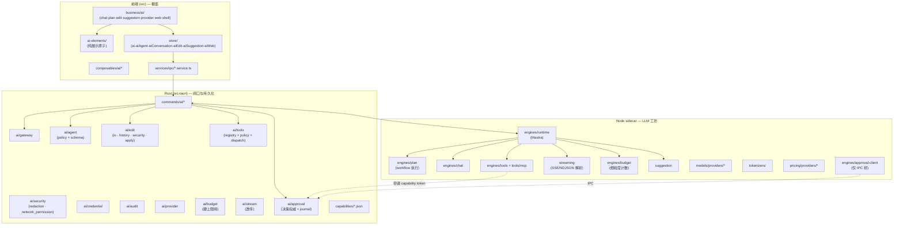

<aside>
📌

本文件是 **Aster** 项目 AI 子系统的结构整改规范，供 AI 助手按条执行。所有改动 MUST 严格依据本文条款；任何条款冲突时以更严格者为准。

本文使用 RFC 2119 关键字：**MUST / MUST NOT / SHOULD / SHOULD NOT / MAY**。

</aside>

## 0. 文档元信息

### 0.1 背景

Aster 是基于 Tauri 2 + Vue 3 + Rust + Node sidecar (Mastra) 的本地优先 AI IDE。AI 子系统跨四层展开，文件量约 150+，是项目体量的一半以上。当前结构存在「跨层契约缺口」「平铺扩张」「安全权威错位」三类系统性债务。

### 0.2 目标 (Goals)

- G1: 建立 AED（Agent Edit Pipeline）核心概念的 **single source of truth**。
- G2: 将 AI 代码按「闸口 / 工坊 / 橱窗」三层职责重新归位。
- G3: 收敛平铺目录，使「目录即文档」。
- G4: 解除 DeepSeek 专属代码对通用层的污染。
- G5: 三端（Rust / Node / 前端）类型与工具清单实现 schema 单源。

### 0.3 非目标 (Non-Goals)

- N1: 不重写任何模块的业务逻辑；本次只做结构整改。
- N2: 不改变 Tauri / Mastra / Vue 三大框架选型。
- N3: 不引入新的 provider；当前仅承认 deepseek/qwen/o200k 三条已实现的路径。
- N4: 不修改 ADR 历史编号；新 ADR 一律走日期制。

### 0.4 术语

- **AED**: Agent Edit Pipeline，AI 编辑流水线。
- **R-AED**: AED 的 runtime 子系统。
- **闸口 (gate)**: 在执行副作用前必须通过的策略检查点。
- **权威层 (authoritative layer)**: 某个概念的唯一正本所在层；其他层只持有只读副本。
- **影子实现 (shadow impl)**: 在非权威层重做一遍权威层的逻辑，本规范一律视为 anti-pattern。

---

## 1. 整体架构原则

### 1.1 三层信任边界

| 层 | 进程 | 信任域 | 应承担 |
| --- | --- | --- | --- |
| **Rust** (`src-tauri/`) | Tauri main | 最高 | 闸口 / 原子性 / 凭证 / 审计 / 持久化决策 |
| **Sidecar** (`agent-sidecar/`) | Node 子进程 | 中等 | LLM 编排 / 第三方 SDK / MCP / tokenizer / stream 解析 |
| **前端** (`src/`) | Webview | 最低 | 渲染 / 用户输入 / 临时视图状态 |

### 1.2 归属判定铁律

<aside>
⚖️

**Rule-LOC**: 任何能力的归属，由「该进程崩溃或被攻陷时，这件事的一致性能否保证」决定。

- 能保证 → MAY 放 sidecar 或前端。
- 不能保证 → **MUST** 放 Rust。
</aside>

### 1.3 反模式清单（一律禁止）

- **AP-1**: 同一概念在两层各自维护可变状态（双份实现）。
- **AP-2**: 安全决策（approval / rollback / capability）的权威落在 sidecar 或前端。
- **AP-3**: 凭证、tokenizer、provider 元数据散布在多层硬编码。
- **AP-4**: 跨进程 IPC 字段无 schema，每端各自定义。
- **AP-5**: 用文件名前缀（如 `mastra-runtime-*`）模拟命名空间，而不下沉到子目录。
- **AP-6**: 通用 utils 目录里混入业务知识（如定价表、provider 配置）。

---

## 2. 当前 AI 代码资产清单

### 2.1 Rust (`src-tauri/src/`)

```
ai/
├── audit.rs                网关：审计日志
├── credential.rs           网关：凭证存储
├── errors.rs
├── favicon.rs              ⚠️ 位置错误（UI 关注点）
├── gateway.rs + gateway/
│   ├── config.rs
│   ├── connection.rs
│   ├── conversation.rs
│   ├── suggestions.rs       ⚠️ 应下放 sidecar
│   └── tests.rs
├── mod.rs
├── network_permission.rs   网关：出口闸
├── provider.rs             provider 权威
├── redaction.rs            出口脱敏
├── stream_manager.rs       ⚠️ 应下放 sidecar，仅保留透传
├── token_budget.rs         ⚠️ 仅保留硬上限闸
└── transport/mod.rs        ⚠️ 占位，需明确实现或删除

ai_agent/
├── mod.rs
├── planner.rs              ⚠️ 仅保留 policy schema，runtime 下放 sidecar
└── policy.rs

ai_edit/                    ⭐ 14 文件，AED 安全核心
├── atomic_write.rs
├── auto_apply.rs
├── diff_render.rs
├── edit_journal.rs
├── errors.rs
├── file_transaction.rs
├── mod.rs
├── path_security.rs
├── pins.rs
├── protected_paths.rs
├── revert.rs
├── snapshot.rs
├── storage_lock.rs
└── timeline.rs

ai_patch/mod.rs             ⚠️ 死代码或占位
ai_tools/
├── mod.rs
└── web_safety.rs           ⚠️ 唯一实现，应并入 ai/network_permission.rs

commands/ai.rs              ⚠️ god 入口文件，需拆为子目录
capabilities/
├── ai.json
├── ai-edit.json
├── ai-index.json
├── ai-tools-readonly.json
└── ai-tools-write.json

tokenizers/{deepseek,o200k,qwen}/tokenizer.json   ⚠️ 静态打包，应下放 sidecar
```

### 2.2 Sidecar (`agent-sidecar/src/`)

```
engines/                    ⚠️ 22 个 mastra-runtime-*.ts 平铺
├── mastra-runtime.ts                   (facade)
├── mastra-runtime-base.ts
├── mastra-runtime-approval.ts          → 应归 approvals/
├── mastra-runtime-approval-utils.ts    → 应归 approvals/（且 approval 权威应迁回 Rust）
├── mastra-runtime-budget.ts            → 应归 budget/
├── mastra-runtime-chat.ts              → 应归 chat/
├── mastra-runtime-context.ts           → 应归 context/
├── mastra-runtime-execution.ts
├── mastra-runtime-messages.ts
├── mastra-runtime-plan.ts              → 应归 plan/
├── mastra-runtime-plan-utils.ts        → 应归 plan/
├── mastra-runtime-responses.ts
├── mastra-runtime-rollback.ts          ⚠️ 影子实现，应删除
├── mastra-runtime-stream-utils.ts      → 应归 streaming/
├── mastra-runtime-tools.ts             → 应归 tools/
├── mastra-runtime-types.ts
├── mastra-runtime-utils.ts
├── mastra-runtime-validation.ts
├── mastra-runtime-workspace.ts
├── plan-store.ts
├── plan-workflow-store.ts
├── runtime-contracts.ts
├── runtime-input.ts
└── runtime.ts

approvals/  config/  context/  rollback/   ⚠️ 空目录或近空，占位
models/
├── deepseek-mastra-gateway.ts          ⚠️ DeepSeek 专属路径
├── deepseek-reasoning-fetch.ts         ⚠️ DeepSeek 专属路径
├── mastra-model-config.ts
└── model-output-budget.ts
schemas/{events,plan-workflow,plan}.ts
streaming/ (8 文件)
tools/{log,mcp,mcp-gateway,time}.ts
```

### 2.3 前端 (`src/`)

```
components/ai-elements/  17 子目录（attachments / chain-of-thought / checkpoint /
                          code-block / context / conversation / file-tree / image /
                          loader / message / plan / prompt-input / queue / shimmer /
                          suggestion / task / terminal）
components/business/ai/  ~30 个 Ai*.vue 平铺 ⚠️
components/editor/AiDiffPreviewEditor.vue  ⚠️ 位置错误
composables/useAi*.ts    9 个 ⚠️
store/{ai,aiAgent,aiConversation,aiEdit}.ts  4 个
types/ai*.{ts,schema.ts}  8 组 + agent-sidecar
utils/{ai-config,ai-diff-ref,ai-patch-preview,ai-patch-summary,
       ai-suggestion-selection,normalize-ai-math}.ts  ⚠️ 部分错位
constants/{ai-provider-icons,ai-providers,ai-runtime-tools,ai-suggestions}.ts
services/modules/{ai,ai-context,ai-edit}.ts  ⚠️ 命名易撞 store
```

---

## 3. 跨层结构性问题（最高优先级）

### 3.1 [🔴 BLOCKER] AED 核心概念在三层各自定义，无 source-of-truth

**现状**：

| 概念 | Rust | Sidecar | 前端 |
| --- | --- | --- | --- |
| Plan | `ai_agent/planner.rs`  • `policy.rs` | `schemas/plan.ts`  • `engines/plan-store.ts`  • `mastra-runtime-plan*.ts` | `store/aiAgent.ts`  • `useAiAgentPlan`  • `AiPlanModePanel` |
| Approval | （无） | `engines/mastra-runtime-approval*.ts` ⚠️ | `AiToolConfirmationCard` |
| Rollback | `ai_edit/{revert,snapshot,journal,timeline,storage_lock,pins}.rs` | `engines/mastra-runtime-rollback.ts` ⚠️ 影子 | （仅 e2e 测试） |
| Stream | `ai/stream_manager.rs` | `streaming/` 8 文件 | `useAiStream` |
| Token budget | `ai/token_budget.rs` | `engines/mastra-runtime-budget.ts`  • `models/model-output-budget.ts` | `useAiTokenContext` |

**整改 (MUST)**：

- **T-3.1.1**: 新增 `docs/architecture/ADR-YYYYMMDD-aed-ownership.md`，按下表锁定权威层：

| 概念 | 权威层 | 影子层（只读） | 同步方向 |
| --- | --- | --- | --- |
| Plan schema & policy | Rust `ai_agent` | sidecar、前端 | Rust → sidecar → 前端 |
| Plan runtime 执行 | Sidecar (Mastra workflow) | 前端展示 | sidecar → 前端 |
| Approval 决策 | Rust（新增 `approval_engine`） | 前端 UI 仅作输入 | 前端 → Rust，Rust → sidecar |
| Edit / Snapshot / Journal / Revert | Rust `ai_edit` | sidecar 仅转发 | 单向 Rust 持久化 |
| Stream 解析 | Sidecar `streaming/` | Rust 透传，前端展示 | sidecar → 前端 |
| Token 细粒度计数 | Sidecar `budget/` | Rust 持硬上限闸 | sidecar 上报，Rust 闸断 |
| Provider 元数据 | Rust `ai/provider.rs` | sidecar 启动握手时收只读副本 | Rust → sidecar |
| Credential | Rust `ai/credential.rs` | 无 | 仅 Rust |
| Audit log | Rust `ai/audit.rs` | 无 | 仅 Rust |
| Capability ACL | Rust `capabilities/*.json` | 无 | 仅 Rust |
- **T-3.1.2**: 任何条目的影子层 MUST NOT 持有可变状态；只能持有最后一次同步的快照。
- **T-3.1.3**: 实现层 MUST 在启动握手协议里下发权威快照，sidecar / 前端 MUST 在握手失败时进入降级只读模式。

### 3.2 [🔴 BLOCKER] Approval 权威错位

**现状**：sidecar `engines/mastra-runtime-approval*.ts` 持有 approval 决策；Rust 无对应模块。

**风险**：Node 进程崩溃 / 被利用即可绕过用户审批。

**整改 (MUST)**：

- **T-3.2.1**: 在 `src-tauri/src/` 新增 `approval_engine/` 模块，包含 `mod.rs` / `decision.rs` / `journal.rs` / `policy.rs`。
- **T-3.2.2**: sidecar 每次工具调用 / edit 提交 / network 出口 MUST 通过 Tauri command 向 Rust 申请 approval token；未获 token 不得执行。
- **T-3.2.3**: Rust approval_engine MUST 持久化每次决策到 SQLite 或 append-only journal，与 `ai_edit/edit_journal.rs` 同等级别。
- **T-3.2.4**: 删除 sidecar 内一切自决路径；`mastra-runtime-approval*.ts` 改名为 `approval-client.ts` 并仅作 IPC 桥接。
- **T-3.2.5**: 前端 `AiToolConfirmationCard` MUST NOT 直接修改任何 store；用户点击后只通过 IPC 调用 Rust，等待回执后再刷新视图。

### 3.3 [🔴 BLOCKER] MCP 工具调用绕过 capability 闸口

**现状**：sidecar `tools/mcp.ts` + `mcp-gateway.ts` 直接调用外部 MCP server；Rust 侧无 MCP 路径，`hooks_mcp.yaml` 无文档。

**整改 (MUST)**：

- **T-3.3.1**: 新增 `src-tauri/capabilities/ai-mcp.json`，按 MCP server 域名 / 工具名细分 allow-list。
- **T-3.3.2**: sidecar MCP 调用 MUST 先向 Rust 申请 `ai-mcp` capability token，token 过期或被拒则中止。
- **T-3.3.3**: `hooks_mcp.yaml` 用途、字段、加载时机 MUST 在新 ADR 中说明，否则删除文件。
- **T-3.3.4**: MCP server URL 配置 MUST 来自 Rust 权威 provider 表，不得在 sidecar 硬编码。

### 3.4 [🔴 HIGH] `edit` / `patch` / `diff` 三命名混用

**现状**：

- Rust 有 `ai_edit/`（14 文件实现）与 `ai_patch/`（仅 `mod.rs`）两个顶级模块。
- 前端有 `ai-edit.ts` / `ai-patch.ts` / `ai-diff-ref.ts` / `ai-patch-preview.ts` / `ai-patch-summary.ts` / `AiDiffPreviewEditor.vue` / `AiPatchPreview.vue` / `AiDiffHunkViewer.vue` / `AiChangedFilesSummary.vue`。

**整改 (MUST)**：

- **T-3.4.1**: 删除 `src-tauri/src/ai_patch/`；其概念若必须保留，作为 `ai_edit/patch.rs` 子模块。
- **T-3.4.2**: 在 `docs/architecture/` 新增一份术语表 ADR，明确：
    - `edit`: 用户意图层（"在这一行替换"）。
    - `patch`: 字节/diff hunk 层（unified diff、line numbers）。
    - `diff`: 渲染呈现层（高亮、并排、行内）。
- **T-3.4.3**: 前端 `utils/ai-patch-*.ts` 与 `utils/ai-diff-ref.ts` MUST 按此术语归位；混用一律视为 bug。

### 3.5 [🟠 HIGH] DeepSeek 专属代码污染通用层

**现状**：

- `agent-sidecar/src/models/deepseek-mastra-gateway.ts`
- `agent-sidecar/src/models/deepseek-reasoning-fetch.ts`
- `src/components/ai-elements/context/deepseek-pricing.ts`（+ `.spec.ts`）
- `src-tauri/tokenizers/deepseek/` 静态打包

**整改 (SHOULD)**：

- **T-3.5.1**: `ai-elements/context/deepseek-pricing.ts` MUST 移出 `ai-elements/`；新位置：`agent-sidecar/src/pricing/providers/deepseek.ts`，由 sidecar 通过 IPC 下发当前定价到前端。
- **T-3.5.2**: `models/deepseek-*.ts` 两文件 MUST 重构为通用 `models/providers/<name>.ts` 模式，统一接口（baseURL / auth / fetch override / reasoning extraction）；DeepSeek 仅作第一个实现。
- **T-3.5.3**: `src-tauri/tokenizers/` 整个目录 MUST 迁移到 `agent-sidecar/tokenizers/`，并改为按需加载（启动时只加载已配置 provider 的 tokenizer）。
- **T-3.5.4**: `ai-providers.ts` / `ai-provider-icons.ts` MUST 改为从 Rust IPC 拉取，前端不内置 provider 列表（图标 SVG 资源除外）。

### 3.6 [🟠 HIGH] Stream 三端契约缺失

**整改 (MUST)**：

- **T-3.6.1**: 在 `proto/` 新增 `ai-stream/v1/stream.proto`（或单一 JSON schema 文件 `schemas/ai-stream.json`），定义事件 ID / 序号 / 心跳 / 错误码。
- **T-3.6.2**: Rust `stream_manager.rs` MUST 退化为透传，仅做 backpressure 与超时；解析逻辑全部移入 sidecar `streaming/`。
- **T-3.6.3**: 前端 `types/ai-stream.schema.ts` MUST 由 proto / json schema 生成，不再手写。

### 3.7 [🟠 MEDIUM] Suggestion 7 处碎片化

**现状**：Rust `ai/gateway/suggestions.rs` + 前端 `useAiSuggestionPool` + `AiFloatingSuggestions` + `ai-elements/suggestion/` + `components/business/ai/suggestion/suggestion-selection.ts` + `constants/ai/suggestions.ts` + `components/business/ai/suggestion/layout.ts`。

**整改 (SHOULD)**：

- **T-3.7.1**: Suggestion 生成权威 MUST 迁到 sidecar，新增 `agent-sidecar/src/suggestion/`。
- **T-3.7.2**: 新增 `src/types/ai-suggestion.schema.ts`，覆盖 pool item / selection / layout 三种数据。
- **T-3.7.3**: 前端三处 utils 合并入 `composables/useAiSuggestionPool.ts` 内部，外部不直接访问。

### 3.8 [🟠 MEDIUM] Token / Context / Budget 三处交错

**整改 (SHOULD)**：

- **T-3.8.1**: Rust `ai/token_budget.rs` MUST 只做「超出 X 拒绝下发」硬上限闸。
- **T-3.8.2**: 细粒度计数 MUST 在 sidecar `budget/`；前端通过 stream 事件接收。
- **T-3.8.3**: `ai-elements/context/deepseek-pricing.ts` 移除（见 T-3.5.1）。
- **T-3.8.4**: `ai-elements/context/` 不得包含任何 provider 特定逻辑；定价数据 MUST 通过 prop 注入。

---

## 4. Rust 内部问题

### 4.1 [🟠 HIGH] 四个 `ai_*` 顶级模块平铺，关系不清

**整改 (SHOULD)**：在 ADR 中明确选择一条路径并执行：

- **方案 A**（推荐）: 折叠为单根 `src-tauri/src/ai/`，内部 `ai/{gateway,agent,edit,tools,approval}/`。
- **方案 B**: 拆为 workspace crates: `crates/ai-gateway`、`crates/ai-edit`、`crates/ai-agent`、`crates/ai-tools`、`crates/ai-approval`。

本规范选 **方案 A**。

**T-4.1.1**: 执行下列 mv（保持 git history）：

```
src-tauri/src/ai/             → src-tauri/src/ai/gateway/
src-tauri/src/ai_agent/       → src-tauri/src/ai/agent/
src-tauri/src/ai_edit/        → src-tauri/src/ai/edit/
src-tauri/src/ai_tools/       → src-tauri/src/ai/tools/
（新增）                       → src-tauri/src/ai/approval/
```

根 `ai/mod.rs` 仅作 re-export。

### 4.2 [🔴 HIGH] `ai_patch/` 死代码

**T-4.2.1**: 删除 `src-tauri/src/ai_patch/`。若发现外部 import，迁移到 `ai/edit/patch.rs`。

### 4.3 [🟠 HIGH] `ai/` 横切关注点平铺

**整改 (MUST)** 在 4.1 折叠之后，进一步分组：

```
ai/
├── mod.rs
├── gateway/         # 原 ai/gateway/ + connection / conversation
│   ├── mod.rs
│   ├── config.rs
│   ├── connection.rs
│   └── conversation.rs
├── security/        # redaction + network_permission + path 出口校验
│   ├── mod.rs
│   ├── redaction.rs
│   └── network_permission.rs
├── credential/      # credential.rs（含 OS keychain 抽象）
├── audit/           # audit.rs + 持久化
├── budget/          # token_budget.rs（仅硬上限闸）
├── stream/          # stream_manager.rs（仅透传）
├── provider/        # provider.rs（含 tokenizer 元数据，不含 tokenizer 文件）
├── transport/       # 已存在；MUST 明确实现或删除空 mod.rs
├── agent/           # planner.rs + policy.rs（policy 与 schema only）
├── edit/            # 见 4.4
├── tools/           # 见 4.5
└── approval/        # 见 3.2
```

**T-4.3.1**: `ai/favicon.rs` MUST 移出 ai/，新位置 `src-tauri/src/commands/ui_assets.rs` 或独立 `src-tauri/src/assets/`。

**T-4.3.2**: `ai/gateway/suggestions.rs` MUST 删除（实现下放 sidecar，见 T-3.7.1）；保留 Rust 侧 IPC 路由即可。

**T-4.3.3**: `transport/mod.rs` 若 30 天内无实现内容，MUST 删除。

### 4.4 [🟠 MEDIUM] `ai_edit/` 14 文件平铺

**T-4.4.1**: 在 `ai/edit/` 下分四子域：

```
ai/edit/
├── mod.rs
├── errors.rs
├── io/
│   ├── atomic_write.rs
│   ├── file_transaction.rs
│   └── storage_lock.rs
├── history/
│   ├── edit_journal.rs
│   ├── snapshot.rs
│   ├── timeline.rs
│   ├── revert.rs
│   └── pins.rs
├── security/
│   ├── path_security.rs
│   └── protected_paths.rs
└── apply/
    ├── auto_apply.rs
    └── diff_render.rs
```

### 4.5 [🟠 MEDIUM] `ai_tools/` 空架子

**T-4.5.1**: `ai_tools/web_safety.rs` MUST 并入 `ai/security/network_permission.rs`。

**T-4.5.2**: 若 30 天内不补足工具注册中心实现，`ai/tools/` 子目录 MUST 删除。

**T-4.5.3**: 若保留，MUST 在内部建立 `registry.rs`（工具注册表）+ `policy.rs`（每个工具所需 capability）+ `dispatch.rs`（路由到 commands/）。

### 4.6 [🟠 HIGH] `commands/ai.rs` 单文件 god 入口

**T-4.6.1**: 拆为 `commands/ai/` 子目录：

```
commands/ai/
├── mod.rs            # re-export
├── gateway.rs        # chat / completion IPC
├── agent.rs          # plan / run IPC
├── edit.rs           # snapshot / apply / revert IPC
├── tools.rs          # 工具调用 IPC（含 MCP capability 申请）
├── approval.rs       # approval token 申请 IPC
└── stream.rs         # stream subscribe IPC
```

### 4.7 [🟢 LOW] Tokenizer 静态打包

**T-4.7.1**: `src-tauri/tokenizers/` 整目录迁至 `agent-sidecar/tokenizers/`。

**T-4.7.2**: sidecar 启动时按已配置 provider 加载 tokenizer；未配置则不加载。

**T-4.7.3**: 若沿用 Rust 侧 tokenization（如审计场景），MUST 通过 sidecar IPC 拿结果，不在 Rust 本地分词。

---

## 5. 前端内部问题

### 5.1 [🟠 HIGH] `components/business/ai/` 30 文件平铺

**T-5.1.1**: 按下表分七组迁移：

```
components/business/ai/
├── chat/
│   ├── AiChatThread.vue
│   ├── AiMessageItem.vue
│   ├── AiPromptInput.vue
│   ├── AiThinkingStatus.vue
│   ├── AiMarkdown.vue
│   ├── AiMarkdownCodeBlock.vue
│   ├── AiMarkdownTable.vue
│   └── AiReasoningCodeBlock.vue
├── plan/
│   ├── AiPlanModePanel.vue
│   ├── AiPlanConfirmationMessage.vue
│   └── AiAgentRuntimeTimeline.vue
├── edit/
│   ├── AiPatchPreview.vue
│   ├── AiDiffHunkViewer.vue
│   ├── AiChangedFilesSummary.vue
│   └── AiDiffPreviewEditor.vue   # 从 components/editor/ 迁入（见 T-5.7）
├── suggestion/
│   └── AiFloatingSuggestions.vue
├── provider/
│   ├── AiProviderIcon.vue
│   └── AiProviderSettings.vue
├── web/
│   ├── AiWebSearchActivity.vue
│   ├── AiWebSourceCard.vue
│   └── AiWebSourcesPanel.vue
└── shell/
    ├── AiAssistantPanel.vue
    ├── AiWorkspaceSurface.vue
    └── AiToolConfirmationCard.vue
```

**T-5.1.2**: 每个子目录 MUST 提供 `index.ts` 统一导出。

### 5.2 [🟠 HIGH] Store / Composable / Schema 拓扑不闭合

**现状缺失**：

- `useAiStream` / `useAiSuggestionPool` / `useAiTokenContext` / `useAiWebSources` 四个 composable **无对应 store**。
- `types/` 缺 `ai-suggestion.schema.ts` / `ai-provider.schema.ts` / `ai-conversation.schema.ts`。

**T-5.2.1**: 为每个 composable 决策一个明确归属：

| Composable | 归属决策 |
| --- | --- |
| `useAiStream` | 状态进 `store/aiConversation.ts`（stream 是 conversation 的一部分） |
| `useAiSuggestionPool` | 新增 `store/aiSuggestion.ts` |
| `useAiTokenContext` | 状态进 `store/aiConversation.ts`（token 是 conversation 的一部分） |
| `useAiWebSources` | 新增 `store/aiWeb.ts`（持久化到 sidecar，见 T-3.5 风格） |

**T-5.2.2**: 新增 schema：

- `src/types/ai-suggestion.schema.ts`
- `src/types/ai-provider.schema.ts`
- `src/types/ai-conversation.schema.ts`

每个 MUST 配 `.schema.spec.ts`，与现有 schema 文件保持一致风格。

### 5.3 [🟢 LOW] `composables/` 平铺

**T-5.3.1**: 30 个 composable 按域分组：`composables/{ai,terminal,editor,workbench,ssh}/`。AI 相关 9 个进 `composables/ai/`。

### 5.4 [🟢 LOW] `types/` 50 文件平铺

**T-5.4.1**: 按域分组：`types/{ai,terminal,editor,git,ssh,workbench,session,app}/`。AI 相关进 `types/ai/`。

### 5.5 [🟠 MEDIUM] `utils/` 错位文件

**T-5.5.1**: `utils/normalize-ai-math.ts` 迁至 `components/business/ai/chat/normalize-math.ts`（与 AiMarkdown 同目录）。

**T-5.5.2**: `utils/ai-config.ts` 迁至 `services/modules/ai-config.service.ts`（或 `store/ai.ts` 内部）。

**T-5.5.3**: `utils/ai-patch-preview.ts` / `ai-patch-summary.ts` / `ai-diff-ref.ts` / `ai-suggestion-selection.ts` MUST 按 5.1 的分组迁至对应 `components/business/ai/<group>/` 内部 utility。

### 5.6 [🟢 LOW] `services/modules/` 撞名 store

**T-5.6.1**: 目录改名 `services/modules/` → `services/ipc/`，文件全部加 `.service.ts` 后缀。

```
src/services/ipc/
├── ai.service.ts
├── ai-context.service.ts
├── ai-edit.service.ts
└── window.service.ts
```

### 5.7 [🟠 MEDIUM] `components/editor/AiDiffPreviewEditor.vue` 错位

**T-5.7.1**: 见 T-5.1.1，迁至 `components/business/ai/edit/`。

**T-5.7.2**: `components/editor/` MUST 保持纯 Monaco / 编辑器原子，不得包含 `Ai*` 前缀文件。

### 5.8 [🟢 LOW] `ai-elements/` 内部不一致

**T-5.8.1**: `ai-elements/checkpoint/` 补 `index.ts`。

**T-5.8.2**: `ai-elements/image/AiImageAttachmentPreviewGrid.vue` 改名为 `ImageAttachmentPreviewGrid.vue`；带 `Ai` 前缀的组件 MUST 进 `business/ai/`，不得在 `ai-elements/`。

**T-5.8.3**: 新增 `src/components/ai-elements/AGENTS.md`，写入两条铁律：

1. ai-elements 文件 MUST NOT import `@/store/*`、`@/services/*`、`@/composables/*`。
2. ai-elements 文件 MUST NOT 包含任何 provider 特定逻辑（定价、tokenizer、SDK 名）。

### 5.9 [🟠 HIGH] 前后端工具清单无契约

**T-5.9.1**: 新增 `tools-manifest.json`（位置：项目根 `schemas/ai-tools-manifest.json`），包含字段：

```json
{
  "$schema": "https://json-schema.org/draft/2020-12/schema",
  "tools": [
    {
      "id": "fs.read_file",
      "title": "读取文件",
      "layer": "rust",
      "capability": "ai-tools-readonly",
      "argsSchema": { /* JSON Schema */ },
      "resultSchema": { /* JSON Schema */ },
      "approval": "none"
    }
  ]
}
```

**T-5.9.2**: 三端 MUST 由此 manifest 生成：

- Rust: `build.rs` 生成 `commands/ai/tools_generated.rs`。
- Sidecar: `scripts/gen-tools.mjs` 生成 `agent-sidecar/src/tools/generated.ts`。
- 前端: `scripts/gen-tools.mjs` 生成 `src/constants/ai/runtime-tools.generated.ts`。

**T-5.9.3**: 删除现有手写 `src/constants/ai/runtime-tools.ts`，用 generated 替代。

---

## 6. Sidecar 边界整改

### 6.1 [🔴 HIGH] `engines/` 22 文件平铺

**T-6.1.1**: 按职责分子目录（复用已存在的空目录）：

```
agent-sidecar/src/engines/
├── runtime.ts                  # 顶层入口
├── mastra-runtime.ts           # facade
├── base.ts                     # 原 mastra-runtime-base.ts
├── types.ts                    # 原 mastra-runtime-types.ts
├── utils.ts                    # 原 mastra-runtime-utils.ts
├── validation.ts
├── workspace.ts
├── execution.ts
├── messages.ts
├── responses.ts
├── chat/
│   └── chat.ts                 # 原 mastra-runtime-chat.ts
├── plan/
│   ├── plan.ts
│   ├── plan-utils.ts
│   ├── plan-store.ts
│   └── plan-workflow-store.ts
├── budget/
│   └── budget.ts
├── context/
│   └── context.ts
├── tools/
│   └── tools.ts
├── stream/
│   └── stream-utils.ts
├── approval-client/            # ⚠️ 改名（决策在 Rust）
│   ├── client.ts
│   └── utils.ts
└── contracts/
    ├── runtime-contracts.ts
    └── runtime-input.ts
```

**T-6.1.2**: 删除 `engines/mastra-runtime-rollback.ts`（见 3.2 决策）。

### 6.2 [🟠 HIGH] 空目录 `approvals/` `config/` `context/` `rollback/`

**T-6.2.1**: 

- `approvals/`: 删除（决策迁回 Rust，sidecar 仅有 `engines/approval-client/`）。
- `rollback/`: 删除。
- `config/`: 保留，MUST 在 30 天内补足实现（provider 配置接收、本地缓存）。
- `context/`: 与 `engines/context/` 合并，二选一。

### 6.3 [🟠 MEDIUM] Models 目录 DeepSeek 专属

**T-6.3.1**: 按 T-3.5.2 重构为：

```
agent-sidecar/src/models/
├── index.ts
├── config.ts                   # 原 mastra-model-config.ts
├── output-budget.ts            # 原 model-output-budget.ts
├── base.ts                     # 通用 provider 接口
└── providers/
    └── deepseek.ts             # 合并原 deepseek-mastra-gateway + reasoning-fetch
```

### 6.4 [🟢 LOW] 新增 `pricing/` 与 `tokenizers/`

**T-6.4.1**: 见 T-3.5.1 与 T-4.7.1。

### 6.5 [🟢 LOW] `.agent-sidecar/mastra.db` 入库

**T-6.5.1**: 在 `.gitignore` 增加 `agent-sidecar/.agent-sidecar/`，并从 git 历史移除已提交的 `mastra.db*`（`git rm --cached`）。

---

## 7. 目标分布图



---

## 8. 改动清单（按优先级排序，给 AI 助手按条执行）

<aside>
⚠️

**执行规则**：

- 每条 task 都有唯一 ID（T-x.x.x），完成后在 commit message 中引用。
- 同一 P 级别的任务 MAY 并行；跨 P 级别 MUST 按 P0 → P1 → P2 → P3 顺序。
- 任何任务的副作用涉及文件移动时，**MUST 使用 `git mv` 保留历史**。
- 重命名 / 删除 / 移动后，MUST 同步更新所有 import 与 `tsconfig.*.json` / `Cargo.toml`。
</aside>

### P0 — 安全 / 死代码（立即执行）

- [ ]  **T-3.1.1** 新建 `docs/architecture/ADR-YYYYMMDD-aed-ownership.md`，包含权威表。
- [ ]  **T-3.2.1 ~ T-3.2.5** 新建 Rust `approval_engine/`，sidecar approval 决策路径全部改为 IPC 申请。
- [ ]  **T-3.3.1 ~ T-3.3.4** 新建 `capabilities/ai-mcp.json`，MCP 调用走 capability token，记录 `hooks_mcp.yaml` 用途或删除。
- [ ]  **T-3.4.1** 删除 `src-tauri/src/ai_patch/`。
- [ ]  **T-4.2.1** 同上。
- [ ]  **T-4.6.1** `commands/ai.rs` 拆为 `commands/ai/` 子目录。
- [ ]  **T-5.2.2** 新增三个 schema：`ai-suggestion` / `ai-provider` / `ai-conversation`。
- [ ]  **T-5.9.1 ~ T-5.9.3** 建立 `schemas/ai-tools-manifest.json` 与三端生成脚本。
- [ ]  **T-6.5.1** `.gitignore` 增加 sidecar 运行时 DB，清理历史。
- [ ]  根目录卫生：删除 `rust_out.exe` / `rust_out.pdb` / `.tmp-terminal-page.png` / `diff-lib.txt` / `diff-undec.txt` / `project-tree.txt` / `tmp/`，加入 `.gitignore`。

### P1 — 结构重组（一周内）

- [ ]  **T-3.4.2** ADR 术语表：edit / patch / diff。
- [ ]  **T-3.6.1 ~ T-3.6.3** Stream 单源 schema。
- [ ]  **T-4.1.1** 四个顶级 `ai_*` 折叠为单 `ai/`。
- [ ]  **T-4.3.1 ~ T-4.3.3** Rust ai/ 子目录化（gateway / security / credential / audit / budget / stream / provider / agent / edit / tools / approval）。
- [ ]  **T-4.4.1** `ai/edit/` 内部按 io / history / security / apply 四分。
- [ ]  **T-4.5.1 ~ T-4.5.3** `ai_tools/web_safety.rs` 处理。
- [ ]  **T-4.7.1 ~ T-4.7.3** Tokenizer 迁 sidecar。
- [ ]  **T-5.1.1 ~ T-5.1.2** `business/ai/` 七分组。
- [ ]  **T-5.2.1** 四个无 store 的 composable 归位。
- [ ]  **T-5.7.1 ~ T-5.7.2** `AiDiffPreviewEditor.vue` 迁位。
- [ ]  **T-6.1.1 ~ T-6.1.2** Sidecar `engines/` 按域分组，删除 rollback 影子。
- [ ]  **T-6.2.1** Sidecar 空目录处理。
- [ ]  **T-3.7.1 ~ T-3.7.3** Suggestion 迁 sidecar + 收口。

### P2 — 解 provider 锁定 + 清扫（两周内）

- [ ]  **T-3.5.1 ~ T-3.5.4** DeepSeek 专属代码通用化。
- [ ]  **T-3.8.1 ~ T-3.8.4** Token / budget / pricing 归位。
- [ ]  **T-5.5.1 ~ T-5.5.3** `utils/` 错位文件迁位。
- [ ]  **T-5.6.1** `services/modules/` 改 `services/ipc/`。
- [ ]  **T-5.8.1 ~ T-5.8.3** `ai-elements/` 准入规范 + 命名修复。
- [ ]  **T-6.3.1** Sidecar `models/` 重构。

### P3 — 长期清扫

- [ ]  **T-5.3.1** `composables/` 按域分组。
- [ ]  **T-5.4.1** `types/` 按域分组。
- [ ]  **T-6.4.1** 新增 `pricing/`。
- [ ]  删除 `src/router/`、`src/views/_legacy/`、`src-tauri/spikes/`（或正式恢复并写 ADR）。
- [ ]  统一 ADR 命名为日期制，回填旧编号映射表。
- [ ]  补 E2E：Approval 拒绝路径 / Provider 切换 / Stream 中断重连 / Plan 取消 / Token 超限降级。
- [ ]  评估 `.venv/` 用途，删除或文档化。
- [ ]  `vendor/` 每个 crate 加 upstream commit + rebase 计划文件。

---

## 9. 验收准则

执行完 P0 + P1 后，下列检查 MUST 全部通过：

- **AC-1**: `rg "mastra-runtime-approval" agent-sidecar/src` 仅在 `engines/approval-client/` 命中。
- **AC-2**: `rg "mastra-runtime-rollback" agent-sidecar/src` 零命中。
- **AC-3**: `find src-tauri/src -name 'ai_*' -type d` 零命中（已折叠入 `ai/`）。
- **AC-4**: `find src-tauri/src/ai_patch -type f` 零命中。
- **AC-5**: `wc -l src-tauri/src/commands/ai.rs` 报错（文件不存在），改为 `src-tauri/src/commands/ai/`。
- **AC-6**: `ls src/components/business/ai/*.vue` 零命中（全部进子目录）。
- **AC-7**: `cat schemas/ai-tools-manifest.json` 存在且通过 JSON Schema 自检。
- **AC-8**: `rg "deepseek" src/components/ai-elements` 零命中。
- **AC-9**: 启动 sidecar 时日志显示「approval client connected to Rust authority」；强制 sidecar 自决路径不存在。
- **AC-10**: 新增 ADR `ADR-YYYYMMDD-aed-ownership.md` 存在，且 `docs/architecture/README.md` 列出该 ADR。

执行完 P2 后追加：

- **AC-11**: `agent-sidecar/tokenizers/` 存在；`src-tauri/tokenizers/` 不存在。
- **AC-12**: `rg "deepseek-pricing" src` 零命中。
- **AC-13**: `ls src/services/modules` 报错；`src/services/ipc/*.service.ts` 存在。
- **AC-14**: `src/components/ai-elements/AGENTS.md` 存在，且包含「MUST NOT import store」规则。

---

## 10. 风险与回滚

- **R-1 (approval 迁移)**: 迁移期间 sidecar 可能出现「等待 Rust 回执超时」。MUST 实现 5s timeout + fallback「自动拒绝并提示用户」，**不得**回退到 sidecar 自决。
- **R-2 (stream 解析迁移)**: Rust 退化为透传期间，旧的 Rust 端解析逻辑 MAY 短暂双写以便对比；切换完成后 MUST 在 7 天内删除影子代码。
- **R-3 (tokenizer 迁移)**: 期间审计场景需要分词时，sidecar MUST 提供同步 IPC；如不可行，暂缓本项至 P3。
- **R-4 (业务停滞)**: 若某个 P1 task 导致 e2e 全红超过 1 个工作日，MUST 启动该 task 的 git revert 并降级为 P2 / P3 评估。

---

## 11. 附录：当前问题速查表

| 编号 | 严重度 | 问题 | 整改 task |
| --- | --- | --- | --- |
| 3.1 | 🔴 BLOCKER | AED 三层各自定义 | T-3.1.1 |
| 3.2 | 🔴 BLOCKER | Approval 权威错位 | T-3.2.* |
| 3.3 | 🔴 BLOCKER | MCP 绕过 capability | T-3.3.* |
| 3.4 | 🔴 HIGH | edit/patch/diff 混名 | T-3.4.* / T-4.2.1 |
| 3.5 | 🟠 HIGH | DeepSeek 渗透通用层 | T-3.5.* |
| 3.6 | 🟠 HIGH | Stream 无单源 schema | T-3.6.* |
| 3.7 | 🟠 MEDIUM | Suggestion 碎片化 | T-3.7.* |
| 3.8 | 🟠 MEDIUM | Token/budget 交错 | T-3.8.* |
| 4.1 | 🟠 HIGH | 四个 ai_* 顶级 | T-4.1.1 |
| 4.2 | 🔴 HIGH | ai_patch 死代码 | T-4.2.1 |
| 4.3 | 🟠 HIGH | ai/ 横切平铺 | T-4.3.* |
| 4.4 | 🟠 MEDIUM | ai_edit/ 14 文件 | T-4.4.1 |
| 4.5 | 🟠 MEDIUM | ai_tools 空架 | T-4.5.* |
| 4.6 | 🟠 HIGH | commands/[ai.rs](http://ai.rs) god | T-4.6.1 |
| 4.7 | 🟢 LOW | Tokenizer 静态 | T-4.7.* |
| 5.1 | 🟠 HIGH | business/ai 平铺 | T-5.1.* |
| 5.2 | 🟠 HIGH | store/composable 拓扑 | T-5.2.* |
| 5.5 | 🟠 MEDIUM | utils 错位 | T-5.5.* |
| 5.6 | 🟢 LOW | services/modules 撞名 | T-5.6.1 |
| 5.7 | 🟠 MEDIUM | editor/AiDiffPreview 错位 | T-5.7.* |
| 5.8 | 🟢 LOW | ai-elements 不一致 | T-5.8.* |
| 5.9 | 🟠 HIGH | 工具清单无契约 | T-5.9.* |
| 6.1 | 🟠 HIGH | engines/ 22 平铺 | T-6.1.* |
| 6.2 | 🟠 HIGH | sidecar 空目录 | T-6.2.1 |
| 6.3 | 🟠 MEDIUM | sidecar models DeepSeek | T-6.3.1 |
| 6.5 | 🟢 LOW | mastra.db 入库 | T-6.5.1 |

---

<aside>
✅

本规范以「闸口 / 工坊 / 橱窗」为最高指导原则。任何不确定归属的代码，先回到 §1.2 Rule-LOC 判定。

</aside>
